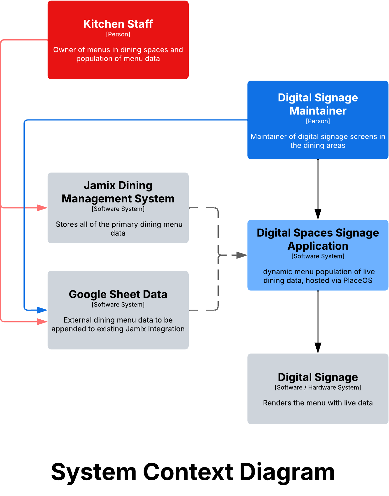

## Overview
We built a Progressive Web App (PWA) that can load and render multiple XML feeds using a shareable URL parameter:
/?source=<sourceId>

A sourceId maps to an allowlisted XML endpoint, parser, and theme. This allows one deployed app to serve many “unique URLs” concurrently (different tabs/users/devices can each open a different source).
The PWA fetches XML directly in the browser (no backend). This requires the XML endpoint to support CORS.

## System Context



## Key Features
1) Multiple endpoints via registry
A static file sources.json contains an allowlist of sources:
name
url (XML endpoint)
parser (schema type)
theme (CSS theme ID)

Example:
```
json{
  "bruinplate": {
    "name": "UCLA Bruin Plate",
    "url": "https://.../BoardInterface/BruinPlate",
    "parser": "jamix_forecastedrecipes",
    "theme": "ucla"
  }
}
```

2) Shareable “unique URLs”
Each dataset is accessible via a stable URL:
https://site/?source=bruinplate
https://site/?source=example_rss
The app reads source from query params, selects the mapped endpoint, and loads/render that dataset.

3) Themes per source (CSS mapping)
Theme selection is controlled by the registry (theme).
Themes are local files (ex: themes/ucla.css) to avoid arbitrary external CSS injection.
The app updates a <link id="themeStyles"> to apply the theme.

4) XML parsing
The app supports multiple XML formats with pluggable parsers:
jamix_forecastedrecipes (custom schema used by UCLA Jamix feed)
Root <forecastedrecipes> with repeated <recipe> nodes
Maps:
Title: Recipe_Print_As
Date: Serve_Date (MM/DD/YYYY)
Filters: Serve_Date, Menu_Type, Menu_Meal_Option
Tags/chips: meal + station + allergens
rss
Uses <item> nodes
Title/date/link/description/categories mapping
atom
Uses <entry> nodes
Title/updated/published/link/category mapping

5) Client-side caching (per source)
Each source is cached separately in localStorage:
xml_pwa_cache_items_<sourceId>
xml_pwa_cache_meta_<sourceId>
This prevents overwriting data between sources and improves UX when switching sources.

6) Filters + search
Global: text search across title/summary/date/tags.
Jamix-only: dropdown filters for:
Date
Meal (Breakfast/Lunch/Dinner/Snack)
Station

7) Offline-friendly app shell
A Service Worker caches the app shell (index.html, app.js, styles.css, themes, manifest, sources.json, icons).
Critical: navigation caching ignores query params, so /?source=... works offline as long as the shell is cached.

## Contributing

See [CONTRIBUTING.md](./CONTRIBUTING.md) for branch strategy, commit conventions, and the PR process.